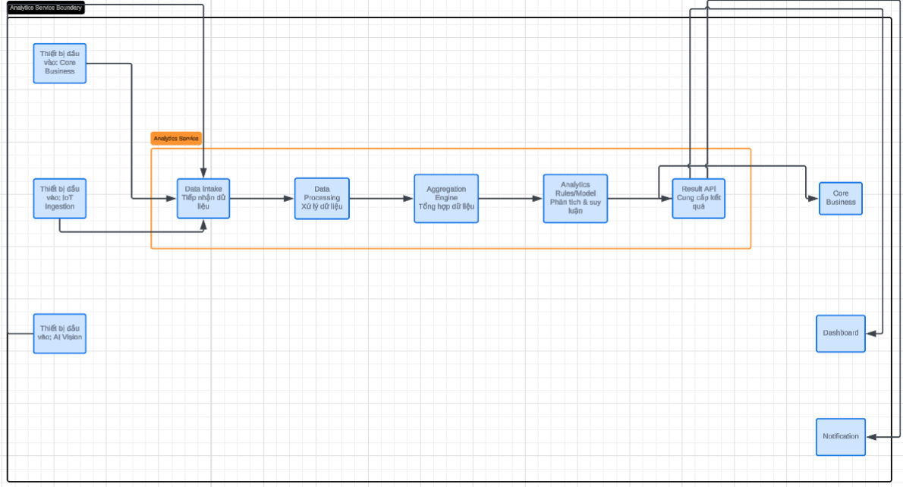

# Service Boundary của nhóm

## 1. Thông tin nhóm

- Tên nhóm:Nhóm 6b
- Lớp:CNTT 17-10
- Thành viên: Trần Văn Công
- Service nhóm phụ trách: service analyst
- Sản phẩm tổng thể của lớp:

## 2. Actor

Ai tương tác với hệ thống/service?
Nhân viên, người dùng, admin hệ thống, các service như IOT,AI Vision, Core, Notification

## 3. System Boundary

Nhóm em xây phần nào?
Tiếp nhận đầu vào, Xử lý dữ liệu, tổng hợp dữ liệu, phân tích suy lận, result API cung cấp kết quả
Phần nhóm kiểm soát:

- ...

Phần nhóm chỉ tích hợp:

- ...

## 4. Service Boundary

Service của nhóm có trách nhiệm gì?
Nhận dữ liệu từ các service khác
Xử lý và phân tích dữ liệu
Tạo kết quả đầu ra phục vụ hệ thống
Cung cấp API cho các service khác sử dụng
Service KHÔNG làm gì?
không quản lý các service khác
## 5. Input / Output

### Input
các api được gửi đến
- ...

### Output
trả về api cung cấp kết quả
- ...

## 6. API dự kiến

## 6. API dự kiến

### Health check
| Method | Endpoint | Mục đích |
|---|---|---|
| GET | /health | Kiểm tra service |

---

### Results (kết quả phân tích)
| Method | Endpoint | Mục đích |
|---|---|---|
| GET | /api/v1/results | Lấy danh sách kết quả phân tích |
| GET | /api/v1/results/{resultId} | Lấy chi tiết một kết quả |
| GET | /api/v1/results?deviceId=&from=&to=&status= | Tra cứu kết quả theo bộ lọc |

---

### Alerts (cảnh báo)
| Method | Endpoint | Mục đích |
|---|---|---|
| GET | /api/v1/alerts | Lấy danh sách cảnh báo |
| GET | /api/v1/alerts/{alertId} | Lấy chi tiết cảnh báo |
| POST | /api/v1/alerts/{alertId}/ack | Xác nhận đã xử lý cảnh báo |

---

### Dashboard
| Method | Endpoint | Mục đích |
|---|---|---|
| GET | /api/v1/dashboard/summary | Tổng hợp dữ liệu dashboard |
| GET | /api/v1/dashboard/trends | Dữ liệu xu hướng |
| GET | /api/v1/dashboard/kpis | Chỉ số KPI chính |

---

### Integration & Notification
| Method | Endpoint | Mục đích |
|---|---|---|
| POST | /api/v1/integrations/core-business/events | Gửi kết quả sang Core Service |
| GET | /api/v1/integrations/core-business/status | Kiểm tra trạng thái tích hợp |
| POST | /api/v1/webhooks/analytics-result | Webhook đẩy dữ liệu ra ngoài |
| POST | /api/v1/notifications | Tạo thông báo |
| GET | /api/v1/notifications/{notificationId} | Lấy thông báo |

## 7. Phụ thuộc service khác

Service này gọi đến service nào?
IoT Service (lấy dữ liệu cảm biến)
AI Vision Service (xử lý hình ảnh)
Database Service (lưu dữ liệu)
Notification Service (gửi cảnh báo)
Service nào gọi đến service này?
Core Service
Dashboard Service
External API clients
Monitoring system
## 8. Sơ đồ minh họa

Có thể vẽ bằng Mermaid, draw.io, Ludichart hoặc ảnh chụp sơ đồ.

```mermaid
flowchart LR
    User[Actor] --> Service[Service của nhóm]
    Service --> DB[(Database)]
    Service --> Other[Service khác]

